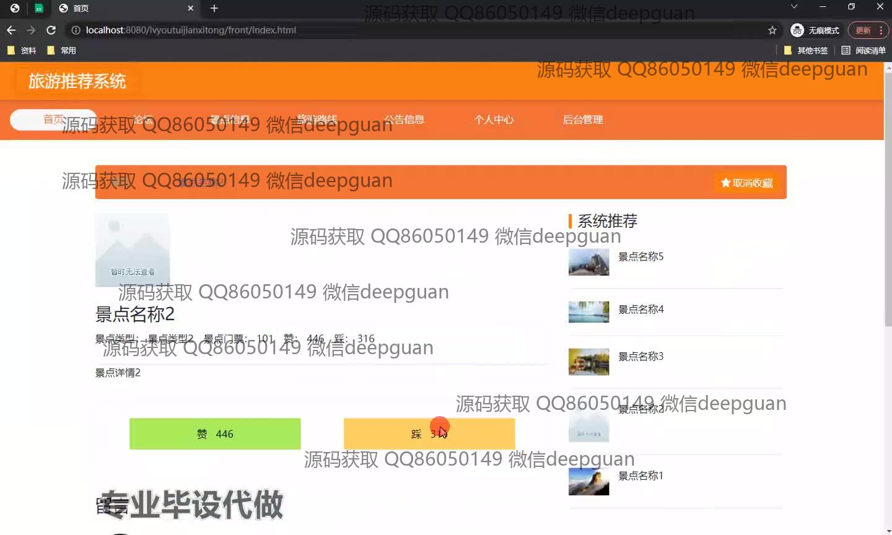
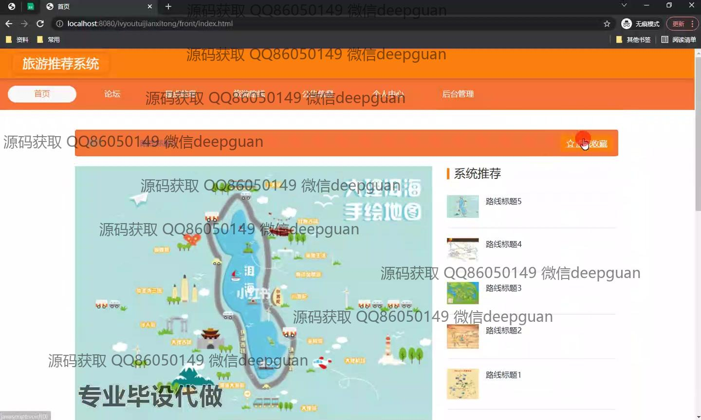
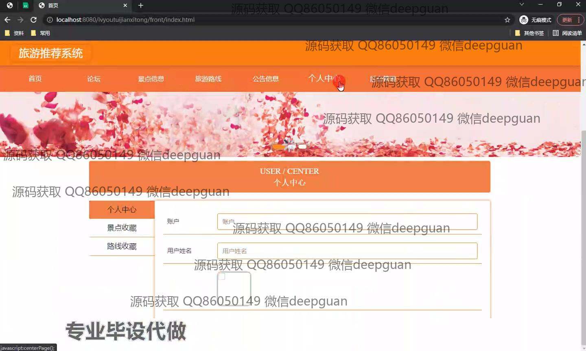
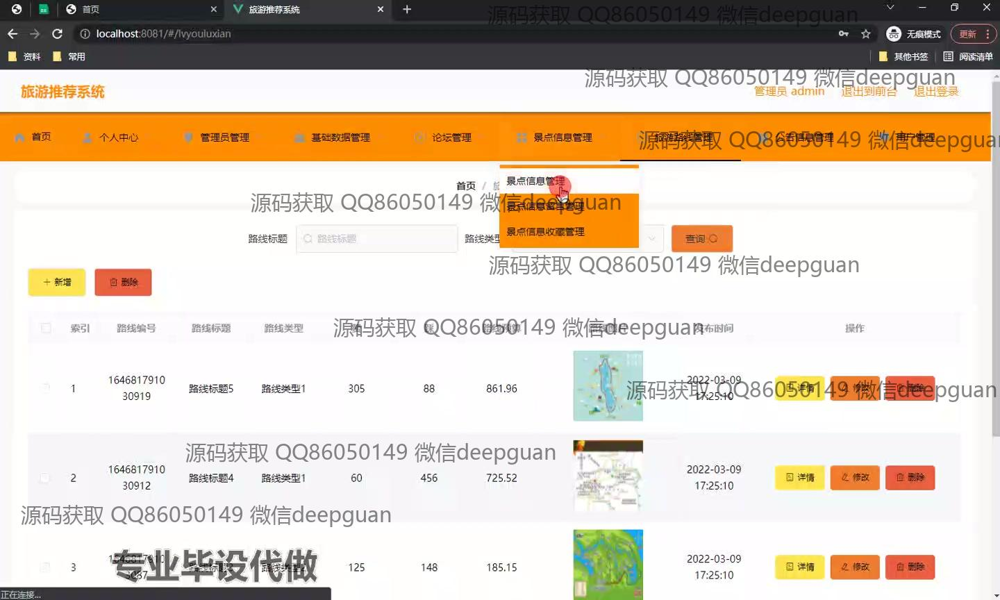
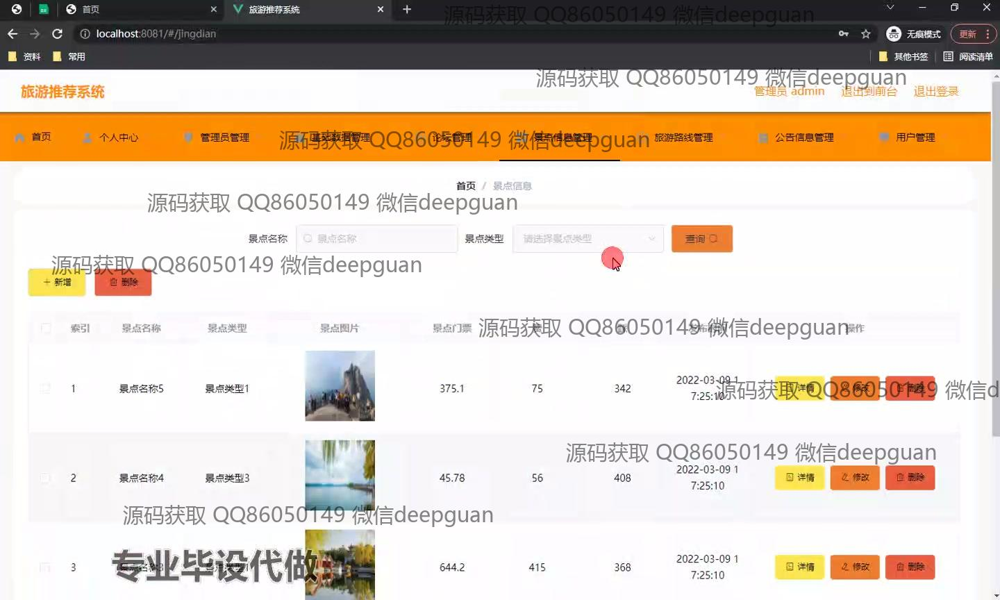

<h1 align="center">基于WEB的旅游推荐系统设计与实现</h1>

## 简介
基于Spring Boot的旅游推荐系统，角色分为管理员、用户，提供论坛、景点信息、旅游路线、公告管理等模块，具备留言、评分、推荐功能，界面简洁直观，便于用户交互与管理。    --计算机毕业设计源码；毕设源码；java毕业设计源码

## 联系方式

<h3 align="center">获取完整代码与数据库文件 + 微信：deepguan QQ: 86050149 QQ群: 783742310</h3>

<h3 align="center">可帮忙远程部署 包运行成功！提供远程部署、修改代码、设计文档指导、代码讲解等服务！</h3>

## 功能介绍（完整见运行截图）
管理员：登录和注册功能，进行身份验证。可以管理和维护深度导览的后台，包括景点信息、旅游路线、用户评论和景点留言的增删改查操作。具备登录系统后的一系列管理功能，如查看和修改景点评分和评论统计。支持发布新公告以及编辑已有内容，确保系统正常运行和信息更新。能够管理论坛帖子，包括审核发帖和回复。支持对用户的注册请求进行管理和审核，根据需要调整用户权限和访问控制。

用户：通过注册和登录进入系统，浏览和查看旅游推荐、景点信息。可以对景点进行点赞或点踩，向其他用户分享体验。能够在论坛模块发帖和回复，参与交流互动。访问个人中心查看个人信息、收藏景点和路线。支持编辑个人资料，进行个性化设置。可以在留言板区域查看其他用户的评论和留言，并发表个人见解。通过系统推荐模块，发现更多景点和旅游路线，并为旅行做出灵感参考。

## 运行截图

本代码来源于网络,仅供学习参考使用!

